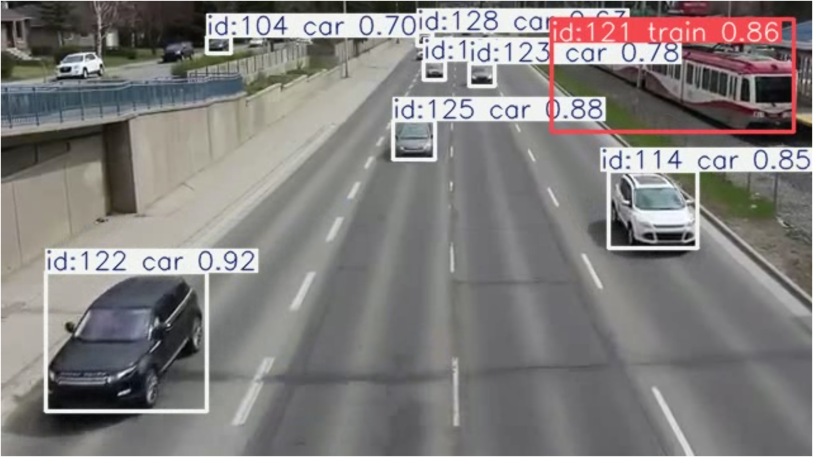
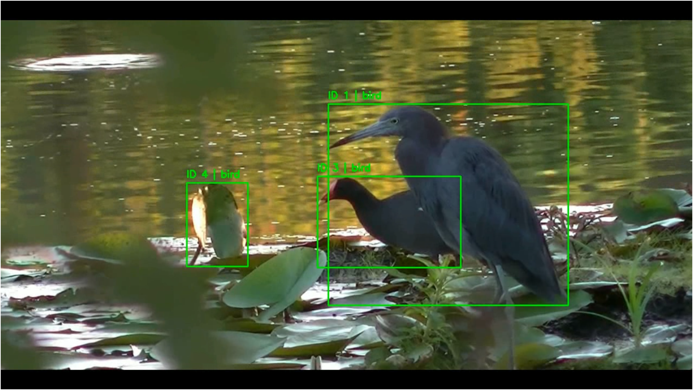

# 🚀 YOLO-Based Object Detection Playground

## 📌 Overview

This project implements a YOLO-based object detection system capable of detecting objects in images and videos. It processes input media, applies a pre-trained YOLO model, and generates annotated outputs along with basic accuracy evaluation.

---

## ✨ Features

* 🔍 Object detection using YOLO models
* 🎥 Supports both image and video input
* 📊 Accuracy evaluation for dataset
* 📁 Organized input/output pipeline
* ⚡ Fast inference using pre-trained models

---

## 🧠 Tech Stack

* Python
* OpenCV
* YOLO (Ultralytics)
* NumPy

---

## 📂 Project Structure

```
Software YOLO Model/
│
├── main.py                     # Main detection script
├── auto_dataset_and_accuracy.py # Accuracy evaluation
├── build_dataset.py            # Dataset preparation
├── static/                     # Frontend / HTML (if used)
├── uploads/                    # Input media (ignored in Git)
├── output/                     # Output results (ignored)
├── dataset/                    # Training data (ignored)
├── YOLO_PreTrained/            # Model environment (ignored)
├── .gitignore
└── README.md
```

---

## ⚙️ Installation & Setup

### 1. Clone the repository

```
git clone https://github.com/Yogendra2804/YOLO_Playground-.git
cd YOLO_Playground-
```

### 2. Install dependencies

```
pip install -r requirements.txt
```

---

## ▶️ Usage

### Run object detection

```
python main.py
```

### Run dataset builder

```
python build_dataset.py
```

### Run accuracy evaluation

```
python auto_dataset_and_accuracy.py
```

---

## 📥 Model Files

⚠️ Pre-trained YOLO model files (`.pt`) are not included in this repository due to size.

👉 Download models from:

* https://github.com/ultralytics/ultralytics

Place them in the root directory before running the project.

---

## 📊 YOLO Model Comparison (CPU-Based)

| Model   | Size        | Accuracy (mAP approx) | CPU Speed        | CPU Load            |
|---------|------------|----------------------|------------------|---------------------|
| YOLOv8n | Very Small | Low (~37–40%)        | ⚡ Very Fast      | 🟢 Low              |
| YOLOv8s | Small      | Medium (~45–50%)     | ⚡ Fast           | 🟡 Medium           |
| YOLOv8m | Medium     | Good (~50–55%)       | ⚡ Moderate       | 🟠 High             |
| YOLOv8l | Large      | High (~55–60%)       | 🐢 Slow           | 🔴 Very High        |
| YOLOv8x | Very Large | Very High (~60%+)    | 🐢 Very Slow      | 🔴 Extremely High   |

> ⭐ YOLOv8m provides the best balance between accuracy and performance on CPU-based systems.

---

## 🎥 Demo

### Object Detection Results

#### Sample 1


#### Sample 2


---

## 🚧 Future Improvements

* Convert into FastAPI backend
* Add real-time webcam detection
* Deploy as a web application
* Improve accuracy metrics

---

## 👨‍💻 Author

**Yogendra Gupta**
GitHub: https://github.com/Yogendra2804

---

## ⭐ Acknowledgements

* Ultralytics YOLO
* OpenCV community
